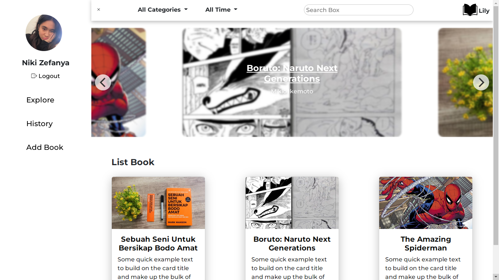

# Lily the Online Library

### Lily the Online Library is a static online library website. This project was created to complete the task of creating a website about online libraries.

# How To Use 

1. Login to this URL https://lily-library.netlify.app/login.html with :
- Email : niki@mail.com
- Passs : niki123

2. If you are logged in, you will be redirected to the main page with the URL https://lily-library.netlify.app

3. On the left of the main page, there is a hamburger button that will bring up a sidebar with various functions such as logout, add bok, etc.

